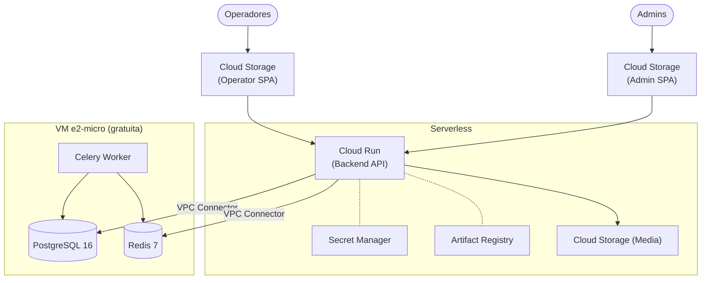

# GCP — Infraestructura, Despliegue y Operación

Referencia única para la infraestructura de GrabaKar en Google Cloud Platform (proyecto `grabakar-staging`).

---

## 1. Arquitectura Actual (Staging — $0/mes)



### Servicios desplegados

| Componente | Servicio GCP | Detalle |
|---|---|---|
| **Operator SPA** | Cloud Storage | `gs://grabakar-frontend-staging` |
| **Admin SPA** | Cloud Storage | `gs://grabakar-admin-staging` |
| **Backend API** | Cloud Run | `grabakar-backend`, `us-central1`, 0–2 instancias |
| **PostgreSQL 16** | Compute Engine e2-micro | VM `grabakar-state-vm`, IP interna `10.128.0.2` |
| **Redis 7** | Compute Engine e2-micro | Mismo VM |
| **Celery Worker** | Compute Engine e2-micro | Mismo Docker image que Cloud Run |
| **Imágenes Docker** | Artifact Registry | `us-central1-docker.pkg.dev/grabakar-staging/grabakar/backend` |
| **Secretos** | Secret Manager | `django-secret-key`, `db-password` |
| **Media** | Cloud Storage | `gs://grabakar-media-staging` |

**URLs staging:**
- Backend: `https://grabakar-backend-1089044937741.us-central1.run.app`
- Operator: `https://storage.googleapis.com/grabakar-frontend-staging/index.html`
- Admin: `https://storage.googleapis.com/grabakar-admin-staging/index.html`

---

## 2. Deploy Manual

### 2.1 Backend (Cloud Run)

```bash
cd grabakar-backend

# Build (linux/amd64 — requerido por Cloud Run)
docker build --platform linux/amd64 \
  -t us-central1-docker.pkg.dev/grabakar-staging/grabakar/backend:latest .

# Push
docker push us-central1-docker.pkg.dev/grabakar-staging/grabakar/backend:latest

# Deploy
gcloud run deploy grabakar-backend \
  --image us-central1-docker.pkg.dev/grabakar-staging/grabakar/backend:latest \
  --platform managed \
  --region us-central1 \
  --allow-unauthenticated \
  --network default \
  --subnet default \
  --vpc-egress private-ranges-only \
  --env-vars-file env.yaml \
  --set-secrets "DJANGO_SECRET_KEY=django-secret-key:latest,DB_PASSWORD=db-password:latest"
```

### 2.2 Frontends (Cloud Storage)

```bash
# Operator app
cd grabakar-frontend && npm run build
gcloud storage cp -r dist/* gs://grabakar-frontend-staging/

# Admin panel
cd grabakar-admin && npm run build
gcloud storage cp -r dist/* gs://grabakar-admin-staging/
```

---

## 3. Bootstrap de Datos en Staging

Usar el workflow de GitHub Actions `bootstrap-staging.yml` (no requiere máquina local):

1. Ir a `grabakar-backend` → **Actions** → **"Bootstrap Staging (Seed Users)"**
2. Primera vez: `load_fixtures=true`, `reset_passwords=false`
3. Reset de passwords: `load_fixtures=false`, `reset_passwords=true`

**Usuarios sembrados** (password: `grabakar123`):

| Username | Rol | panel_persona |
|---|---|---|
| `admin` | admin | platform_admin + is_staff=True |
| `supervisor` | supervisor | none |
| `operador` | operador | none |
| `test` | operador | none |

---

## 4. Operación del VM (PostgreSQL + Redis + Celery)

### Health check y backup (cron en el VM)

Scripts en `grabakar-infra/scripts/`:

```bash
# Copiar al VM y hacer ejecutables
chmod +x vm_health_check.sh vm_backup_postgres.sh

# Cron (editar con crontab -e):
*/5 * * * * /home/$USER/grabakar-infra/scripts/vm_health_check.sh >> ~/grabakar-vm-health.log 2>&1
0 3 * * * /home/$USER/grabakar-infra/scripts/vm_backup_postgres.sh >> ~/grabakar-vm-backup.log 2>&1
```

Backup destino: `gs://grabakar-media-staging/backups/` (requiere `gcloud auth` en el VM).

---

## 5. CI/CD con GitHub Actions

Ver `DEVOPS_CICD_STRATEGY.md` para los workflows completos. Resumen:

| Trigger | Workflow | Acción |
|---|---|---|
| PR a `main` | `ci.yml` | ruff + pytest (backend) / build + vitest (frontend) |
| Push a `main` | `deploy.yml` | build → push → Cloud Run/GCS deploy |
| Manual | `bootstrap-staging.yml` | Seed staging DB con usuarios de prueba |

### Autenticación: Workload Identity Federation (WIF)

La org de GCP tiene la policy `iam.disableServiceAccountKeyCreation` activa ("Secure by Default"), por lo que **no se pueden crear JSON keys** de service accounts.

En su lugar, se usa **Workload Identity Federation** con OIDC tokens de GitHub:

| Recurso | Valor |
|---|---|
| **Service Account** | `github-actions@grabakar-staging.iam.gserviceaccount.com` |
| **WIF Pool** | `github-actions-pool` |
| **WIF Provider** | `github-actions-provider-2` |
| **Provider URI** | `projects/1089044937741/locations/global/workloadIdentityPools/github-actions-pool/providers/github-actions-provider-2` |
| **Attribute condition** | `assertion.repository_owner == 'grabakar'` |

**Roles asignados al SA `github-actions`:**
- `roles/run.admin` — Deploy a Cloud Run
- `roles/storage.admin` — Upload a GCS buckets
- `roles/iam.serviceAccountUser` — Actuar como SA en Cloud Run
- `roles/artifactregistry.admin` — Push Docker images
- `roles/compute.instanceAdmin.v1` — SSH al VM para migraciones y Celery

**Rol adicional en el VM** (Compute Engine default SA):
- `roles/artifactregistry.reader` — El VM necesita pull Docker images desde Artifact Registry

**No se requieren GitHub Secrets.** La autenticación es completamente keyless via OIDC.

En los workflows, se configura así:
```yaml
permissions:
  contents: read
  id-token: write   # Requerido para WIF
steps:
  - uses: google-github-actions/auth@v2
    with:
      workload_identity_provider: 'projects/1089044937741/locations/global/workloadIdentityPools/github-actions-pool/providers/github-actions-provider-2'
      service_account: 'github-actions@grabakar-staging.iam.gserviceaccount.com'
```

### Gotcha: Docker auth dentro del VM

Cuando GitHub Actions hace SSH al VM para correr migraciones o restart Celery, el comando `docker pull` falla si Docker no está autenticado contra Artifact Registry **dentro de la sesión SSH**. Por eso cada bloque SSH incluye:
```bash
gcloud auth configure-docker us-central1-docker.pkg.dev --quiet
```
Antes de cualquier `docker pull`.

---

## 6. Monitoreo

- **Uptime check**: Cloud Monitoring → `/api/v1/health/` en Cloud Run `grabakar-backend` ⏳ pendiente de configurar
- **Logs**: Cloud Run → Cloud Logging (automático)
- **Backup**: cron diario en el VM → GCS

---

## 7. Limitaciones Staging / Trabajo Futuro

| Limitación | Resolución futura |
|---|---|
| Dominio `.run.app` y `storage.googleapis.com` | Custom domain vía Cloud Load Balancing o Firebase Hosting |
| VM e2-micro sin HA (single point of failure) | Cloud SQL + Memorystore en producción (~$100-200/mes) |
| Deploy manual | ✅ Resuelto — GitHub Actions con WIF OIDC |
| Sin monitoreo activo | Cloud Monitoring uptime check (pendiente) |

### Costos estimados producción

| Servicio | Config | Costo/mes |
|---|---|---|
| Cloud SQL | db-g1-small HA | ~$50 |
| Memorystore | Basic 1GB | ~$25 |
| Cloud Run | min_instances=1 | ~$20 |
| Cloud Run (Celery) | separate worker | ~$20 |
| **Total** | | **~$115-200** |

---

## 8. Setup Inicial (si se parte desde cero)

```bash
# 1. Crear proyecto
gcloud projects create $PROJECT_ID --name="GrabaKar"
gcloud config set project $PROJECT_ID

# 2. Habilitar APIs
gcloud services enable \
  iam.googleapis.com iamcredentials.googleapis.com \
  cloudresourcemanager.googleapis.com \
  run.googleapis.com artifactregistry.googleapis.com \
  secretmanager.googleapis.com storage.googleapis.com \
  compute.googleapis.com

# 3. Artifact Registry
gcloud artifacts repositories create grabakar \
  --repository-format=docker --location=us-central1

# 4. Secrets
echo -n "$(openssl rand -base64 50)" | gcloud secrets create django-secret-key --data-file=-

# 5. Cloud Storage buckets
for bucket in grabakar-frontend-staging grabakar-admin-staging grabakar-media-staging; do
  gcloud storage buckets create gs://$bucket --location=us-central1
done
gcloud storage buckets update gs://grabakar-frontend-staging \
  --web-main-page-suffix=index.html --web-error-page=index.html
gcloud storage buckets update gs://grabakar-admin-staging \
  --web-main-page-suffix=index.html --web-error-page=index.html

# 6. VM e2-micro
gcloud compute instances create grabakar-state-vm \
  --zone=us-central1-a --machine-type=e2-micro \
  --boot-disk-size=30GB --boot-disk-type=pd-standard \
  --scopes=cloud-platform \
  --tags=http-server,https-server
# SSH → instalar Docker → levantar postgres:16, redis:7, celery worker
# Dar acceso AR al VM default SA:
# gcloud projects add-iam-policy-binding $PROJECT_ID \
#   --member="serviceAccount:$PROJECT_NUMBER-compute@developer.gserviceaccount.com" \
#   --role="roles/artifactregistry.reader"

# 7. Workload Identity Federation (ver sección 5 arriba)
# Ejecutar setup_wif.sh o ver tecnico/deployments/GCP_STAGING_DEPLOYMENT.md
```

Ver también: `tecnico/deployments/GCP_STAGING_DEPLOYMENT.md` para documentación completa del deployment staging.
