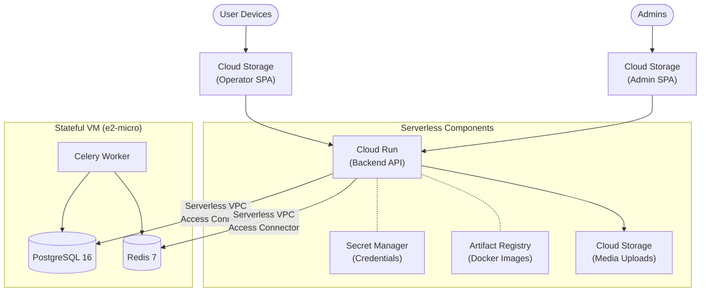

# GrabaKar — GCP Staging Architecture ($0/month)

This document describes the current infrastructure deployed on Google Cloud Platform (project `grabakar-staging`) using "Always Free" tier resources to maintain a cost of $0/month.

## Architecture Diagram



## Deployed Services

### 1. Frontends (Google Cloud Storage)
The frontends are static Single Page Applications (SPAs) built with Vite and React, hosted directly inside public GCS buckets.
- **Operator App bucket:** `gs://grabakar-frontend-staging`
- **Admin App bucket:** `gs://grabakar-admin-staging`
- **Public URLs:**
  - Operator: https://storage.googleapis.com/grabakar-frontend-staging/index.html
  - Admin: https://storage.googleapis.com/grabakar-admin-staging/index.html

*Note: Because they are SPAs, the buckets are configured with `index.html` as both the main page and the error page (for client-side routing).*

### 2. Backend API (Cloud Run)
- **Service Name:** `grabakar-backend`
- **Location:** `us-central1`
- **URL:** `https://grabakar-backend-1089044937741.us-central1.run.app`
- **Scaling:** 0 to 2 instances
- **Environment config:** `config.settings.production`
- **Networking:** Egress traffic to private IPs is routed through the default VPC to allow connection to the database VM.

### 3. Database & Workers (Compute Engine)
Managed databases (Cloud SQL, Memorystore) cost money. To achieve the $0/month goal, a single free-tier `e2-micro` virtual machine is used:
- **Instance Name:** `grabakar-state-vm`
- **Internal IP:** `10.128.0.2`
- **Containers Running:**
  - `postgres:16`
  - `redis:7`
  - `grabakar-celery-worker` (runs the same Docker image as Cloud Run, but via `celery -A config worker`)

### 4. Supporting Services
- **Artifact Registry:** Holds the backend Docker images (`us-central1-docker.pkg.dev/grabakar-staging/grabakar/backend`)
- **Secret Manager:** Stores sensitive data mounted into Cloud Run at runtime:
  - `django-secret-key`
  - `db-password`
- **Media Storage:** `gs://grabakar-media-staging` (handled via `django-storages` in the backend).

## Deployment Cheat Sheet

### Deploying the Backend
1. Build the Docker image for the correct architecture (Cloud Run uses `linux/amd64`):
   ```bash
   cd grabakar-backend
   docker build --platform linux/amd64 -t us-central1-docker.pkg.dev/grabakar-staging/grabakar/backend:latest .
   ```
2. Push to Artifact Registry:
   ```bash
   docker push us-central1-docker.pkg.dev/grabakar-staging/grabakar/backend:latest
   ```
3. Deploy to Cloud Run:
   ```bash
   gcloud run deploy grabakar-backend \
     --image us-central1-docker.pkg.dev/grabakar-staging/grabakar/backend:latest \
     --platform managed \
     --region us-central1 \
     --allow-unauthenticated \
     --network default \
     --subnet default \
     --vpc-egress private-ranges-only \
     --env-vars-file env.yaml \
     --set-secrets "DJANGO_SECRET_KEY=django-secret-key:latest,DB_PASSWORD=db-password:latest"
   ```

### Deploying the Frontends
1. Build the React applications:
   ```bash
   # Operator app
   cd grabakar-frontend
   npm run build

   # Admin panel
   cd grabakar-admin
   npx vite build --base=/grabakar-admin-staging/
   ```
2. Upload to Cloud Storage:
   ```bash
   gcloud storage cp -r grabakar-frontend/dist/* gs://grabakar-frontend-staging/
   gcloud storage cp -r grabakar-admin/dist/* gs://grabakar-admin-staging/
   ```

## Known Limitations / Future Work
- **Domain Names:** Currently using `.run.app` and `storage.googleapis.com` domains. Future stages should map `panchopin.com` domains (e.g., `app.panchopin.com`) via Cloud Load Balancing or Firebase Hosting to provide custom SSL certs.
- **CI/CD:** These manual commands should be replaced by GitHub Actions workflows (see epic **P5-01** in `BACKLOG.md`).
