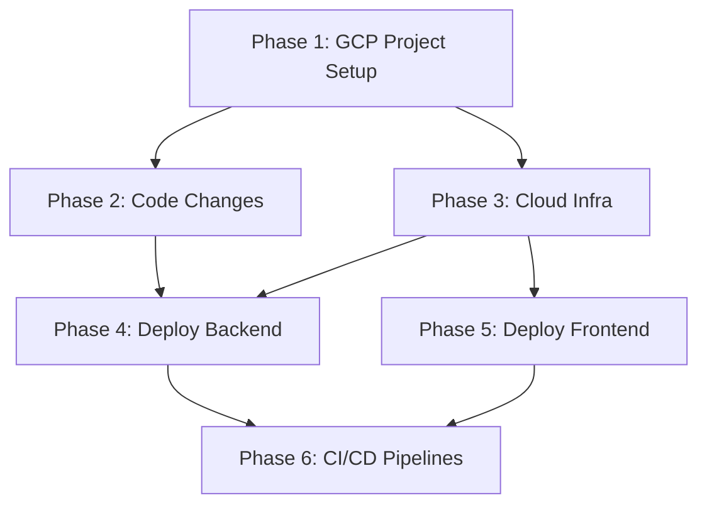

# GrabaKar — GCP Deployment: Evaluation & Plan

## Current Readiness Assessment

### ✅ What's Already GCP-Ready

| Component | Status | Notes |
|---|---|---|
| **Dockerfile** | ✅ Ready | Multi-stage, Cloud Run compatible, `gunicorn` on port 8000 |
| **Env-var config** | ✅ Ready | All settings from `os.getenv()` — DB, Redis, JWT, CORS |
| **`dj-database-url`** | ✅ Installed | In `requirements.txt` (but not used in `base.py` yet) |
| **`psycopg2-binary`** | ✅ Installed | PostgreSQL driver |
| **`production.py`** | ⚠️ Partial | Has SSL/HSTS but missing Cloud SQL socket, logging, `SECURE_PROXY_SSL_HEADER` |
| **`DEPLOYMENT.md`** | ✅ Ready | Already documents GCP architecture and deploy commands |
| **Frontend (Vite build)** | ✅ Ready | `npm run build` → static files in `dist/`, deployable to CDN |

### ❌ What's Missing

| Gap | Effort | Required Before Deploy |
|---|---|---|
| `django-storages[google]` not in `requirements.txt` | 5 min | Yes — for GCS media storage |
| `production.py` incomplete (no Cloud SQL Unix socket, no proxy SSL header, no logging) | 15 min | Yes |
| No Artifact Registry setup | CLI commands | Yes |
| No Cloud Run service or service account | CLI commands | Yes |
| No Cloud SQL instance | CLI/Terraform | Yes |
| No Memorystore (Redis) instance | CLI/Terraform | Yes |
| No Secret Manager secrets | CLI commands | Yes |
| Celery worker strategy for Cloud Run | Design decision | Yes |
| No GitHub Actions deploy workflow (only a template in docs) | 30 min | For CI/CD, not manual deploy |
| No custom domain / SSL certificates | GCP + DNS | For production URLs |
| Frontend hosting not configured (no GCS bucket + CDN) | CLI + build config | Yes |

---

## GCP Architecture

```
                    ┌─────────────────────────────────────┐
                    │           Cloud CDN                  │
                    │     app.grabakar.cl (frontend)       │
                    │     Cloud Storage (static bucket)    │
                    └──────────────┬──────────────────────┘
                                   │
    ┌──────────────────────────────┼───────────────────────┐
    │                              │                       │
    ▼                              ▼                       ▼
┌──────────┐              ┌──────────────┐        ┌──────────────┐
│Cloud Run │              │ Cloud Run    │        │Cloud Scheduler│
│ Backend  │              │ Celery Worker│        │  (beat jobs)  │
│ (API)    │              │ (always-on)  │        │               │
└────┬─────┘              └──────┬───────┘        └───────┬───────┘
     │                           │                        │
     └──────────┬────────────────┘                        │
                │                                         │
    ┌───────────┴──────────┐       ┌──────────────────────┘
    │                      │       │
    ▼                      ▼       ▼
┌──────────┐        ┌──────────┐
│Cloud SQL │        │Memorystore│
│PostgreSQL│        │  Redis    │
│  16      │        │           │
└──────────┘        └──────────┘
    ↕                   ↕
 Secret Manager (all credentials)
```

---

## GCP Services & Cost Estimate

### Staging Environment (~$50-80/month)

| Service | Config | Est. Cost/mo |
|---|---|---|
| **Cloud Run (backend API)** | 1 instance, 0.5 vCPU, 512MB, min 0 instances | ~$5-10 (scale to zero) |
| **Cloud Run (Celery worker)** | 1 instance always-on, 0.5 vCPU, 512MB | ~$15-20 |
| **Cloud SQL (PostgreSQL 16)** | `db-f1-micro`, 10GB SSD, no HA | ~$8-12 |
| **Memorystore (Redis)** | Basic tier, 1GB M1 | ~$15-20 |
| **Cloud Storage** | Frontend bucket + media, <1GB | ~$0.50 |
| **Secret Manager** | ~10 secrets | ~$0.06 |
| **Artifact Registry** | Container images, <5GB | ~$0.50 |
| **Cloud CDN** | Minimal traffic | ~$1-3 |
| **Cloud Scheduler** | 2-3 cron jobs (Celery beat replacement) | ~$0.30 |

> [!TIP]
> **Free Tier:** Cloud Run offers 2M requests/month free, and Cloud SQL has no free tier but `db-f1-micro` is the cheapest option. Memorystore has no free tier — this is the biggest fixed cost. An alternative is to use Cloud Run + a Redis sidecar or an in-memory broker (but Celery needs Redis).

### Production Environment (~$100-200/month)

Same as staging but:
- Cloud SQL: `db-g1-small` with HA → ~$50
- Memorystore: Basic 1GB → ~$20
- Cloud Run: min 1 instance (no cold starts) → ~$25-35
- Daily backups: ~$3

---

## Celery on Cloud Run — Design Decision

> [!IMPORTANT]
> Cloud Run is designed for request-driven workloads. Celery workers are long-running processes. This requires a specific approach.

### Options Evaluated

| Option | Pros | Cons | Recommendation |
|---|---|---|---|
| **A. Cloud Run always-on** (min instances = 1) | Simple, same image | Costs even when idle, single process per container | ✅ **Best for MVP** |
| **B. Compute Engine (small VM)** | Full control, cheap for always-on | Manual management, not serverless | Good for production |
| **C. Cloud Run Jobs** | Pay only when running | Only for batch, not for persistent worker | Not suitable for Celery |
| **D. Replace Celery with Cloud Tasks** | Fully serverless, no Redis needed | Code rewrite, GCP lock-in | Future optimization |

### Recommended Approach

- **API backend**: Cloud Run (scales to zero, handles HTTP requests)
- **Celery worker**: Cloud Run with `min-instances=1` (always-on, consumes from Redis)
- **Celery beat replacement**: Cloud Scheduler → HTTP trigger to Cloud Run endpoint that dispatches Celery tasks
  - Instead of `celery beat`, create a Cloud Scheduler cron that calls `POST /api/internal/trigger-report/` which dispatches the Celery task
  - This eliminates the need for a separate beat container

---

## Implementation Phases

### Phase 1 — GCP Project Setup (30 min, manual)

No code changes. All via `gcloud` CLI or GCP Console.

1. Create GCP project: `grabakar-staging`
2. Enable required APIs:
   - Cloud Run, Cloud SQL Admin, Artifact Registry, Secret Manager, Memorystore, Cloud Storage, Cloud Scheduler
3. Create service account: `grabakar-backend@grabakar-staging.iam.gserviceaccount.com`
4. Grant roles: `roles/cloudsql.client`, `roles/secretmanager.secretAccessor`, `roles/storage.objectAdmin`, `roles/run.invoker`

```bash
gcloud projects create grabakar-staging --name="GrabaKar Staging"
gcloud config set project grabakar-staging

# Enable APIs
gcloud services enable \
  run.googleapis.com \
  sqladmin.googleapis.com \
  artifactregistry.googleapis.com \
  secretmanager.googleapis.com \
  redis.googleapis.com \
  storage.googleapis.com \
  cloudscheduler.googleapis.com \
  cloudbuild.googleapis.com
```

---

### Phase 2 — Backend Code Changes (15 min)

#### [MODIFY] [requirements.txt](file:///Users/franciscocollarte/Documents/grabado-patente-app/grabakar-backend/requirements.txt)

Add `django-storages[google]` for GCS media storage:

```diff
+django-storages[google]>=1.14.0
```

#### [MODIFY] [production.py](file:///Users/franciscocollarte/Documents/grabado-patente-app/grabakar-backend/config/settings/production.py)

Expand production settings with Cloud SQL Unix socket, proxy SSL header, logging, and GCS storage:

```python
import os
from .base import *

DEBUG = False

# --- Security ---
SECURE_SSL_REDIRECT = True
SECURE_HSTS_SECONDS = 31536000
SECURE_HSTS_INCLUDE_SUBDOMAINS = True
SECURE_HSTS_PRELOAD = True
SESSION_COOKIE_SECURE = True
CSRF_COOKIE_SECURE = True
SECURE_PROXY_SSL_HEADER = ('HTTP_X_FORWARDED_PROTO', 'https')  # Cloud Run terminates SSL

# --- Cloud SQL Unix Socket ---
# Cloud Run connects to Cloud SQL via Unix socket, not TCP
if os.getenv('CLOUD_SQL_CONNECTION_NAME'):
    DATABASES['default']['HOST'] = f"/cloudsql/{os.getenv('CLOUD_SQL_CONNECTION_NAME')}"

# --- GCS Storage (media files) ---
if os.getenv('GS_BUCKET_NAME'):
    DEFAULT_FILE_STORAGE = 'storages.backends.gcloud.GoogleCloudStorage'
    GS_BUCKET_NAME = os.getenv('GS_BUCKET_NAME')
    GS_DEFAULT_ACL = 'publicRead'

# --- Logging ---
LOGGING = {
    'version': 1,
    'disable_existing_loggers': False,
    'handlers': {
        'console': {'class': 'logging.StreamHandler'},
    },
    'root': {'handlers': ['console'], 'level': 'INFO'},
    'loggers': {
        'django': {'handlers': ['console'], 'level': 'WARNING'},
    },
}
```

---

### Phase 3 — Cloud Infrastructure (CLI commands)

#### 3A. Artifact Registry (container images)

```bash
gcloud artifacts repositories create grabakar \
  --repository-format=docker \
  --location=southamerica-east1 \
  --description="GrabaKar container images"
```

#### 3B. Cloud SQL (PostgreSQL 16)

```bash
gcloud sql instances create grabakar-pg-staging \
  --database-version=POSTGRES_16 \
  --tier=db-f1-micro \
  --region=southamerica-east1 \
  --storage-size=10GB \
  --storage-auto-increase

gcloud sql databases create grabakar --instance=grabakar-pg-staging

gcloud sql users create grabakar \
  --instance=grabakar-pg-staging \
  --password="$(openssl rand -base64 24)"
```

#### 3C. Memorystore (Redis)

```bash
gcloud redis instances create grabakar-redis-staging \
  --size=1 \
  --region=southamerica-east1 \
  --redis-version=redis_7_0 \
  --tier=basic
```

> [!WARNING]
> Memorystore requires **VPC Connector** for Cloud Run to connect. This adds ~$7/month but is required.

```bash
gcloud compute networks vpc-access connectors create grabakar-connector \
  --network=default \
  --region=southamerica-east1 \
  --range=10.8.0.0/28 \
  --min-instances=2 \
  --max-instances=3
```

#### 3D. Secret Manager

```bash
echo -n "$(openssl rand -base64 50)" | gcloud secrets create django-secret-key --data-file=-
echo -n "<db-password>" | gcloud secrets create db-password --data-file=-
```

#### 3E. Cloud Storage (frontend + media)

```bash
# Frontend static hosting
gcloud storage buckets create gs://grabakar-frontend-staging \
  --location=southamerica-east1 \
  --uniform-bucket-level-access

# Media uploads
gcloud storage buckets create gs://grabakar-media-staging \
  --location=southamerica-east1
```

---

### Phase 4 — Deploy Backend to Cloud Run

```bash
# Build and push image
gcloud builds submit \
  --tag southamerica-east1-docker.pkg.dev/grabakar-staging/grabakar/backend:latest \
  ./repos/grabakar-backend

# Deploy API
gcloud run deploy grabakar-backend \
  --image southamerica-east1-docker.pkg.dev/grabakar-staging/grabakar/backend:latest \
  --platform managed \
  --region southamerica-east1 \
  --allow-unauthenticated \
  --add-cloudsql-instances grabakar-staging:southamerica-east1:grabakar-pg-staging \
  --vpc-connector grabakar-connector \
  --set-env-vars "DJANGO_SETTINGS_MODULE=config.settings.production" \
  --set-env-vars "CLOUD_SQL_CONNECTION_NAME=grabakar-staging:southamerica-east1:grabakar-pg-staging" \
  --set-env-vars "DB_NAME=grabakar,DB_USER=grabakar,DB_PORT=5432" \
  --set-env-vars "CELERY_BROKER_URL=redis://<REDIS_IP>:6379/0" \
  --set-env-vars "CORS_ALLOWED_ORIGINS=https://staging.grabakar.cl" \
  --set-secrets "DJANGO_SECRET_KEY=django-secret-key:latest" \
  --set-secrets "DB_PASSWORD=db-password:latest" \
  --min-instances 0 \
  --max-instances 5 \
  --memory 512Mi \
  --cpu 1

# Deploy Celery worker (same image, different command)
gcloud run deploy grabakar-celery \
  --image southamerica-east1-docker.pkg.dev/grabakar-staging/grabakar/backend:latest \
  --platform managed \
  --region southamerica-east1 \
  --no-allow-unauthenticated \
  --command "celery,-A,config,worker,-l,info,--concurrency,2" \
  --add-cloudsql-instances grabakar-staging:southamerica-east1:grabakar-pg-staging \
  --vpc-connector grabakar-connector \
  --set-env-vars "DJANGO_SETTINGS_MODULE=config.settings.production" \
  --set-env-vars "CLOUD_SQL_CONNECTION_NAME=grabakar-staging:southamerica-east1:grabakar-pg-staging" \
  --set-secrets "DJANGO_SECRET_KEY=django-secret-key:latest,DB_PASSWORD=db-password:latest" \
  --min-instances 1 \
  --max-instances 2 \
  --memory 512Mi \
  --cpu 1
```

#### Run Migrations (one-time)

```bash
gcloud run jobs create grabakar-migrate \
  --image southamerica-east1-docker.pkg.dev/grabakar-staging/grabakar/backend:latest \
  --command "python,manage.py,migrate" \
  --add-cloudsql-instances grabakar-staging:southamerica-east1:grabakar-pg-staging \
  --vpc-connector grabakar-connector \
  --set-env-vars "DJANGO_SETTINGS_MODULE=config.settings.production" \
  --set-secrets "DJANGO_SECRET_KEY=django-secret-key:latest,DB_PASSWORD=db-password:latest" \
  --region southamerica-east1

gcloud run jobs execute grabakar-migrate --region southamerica-east1
```

---

### Phase 5 — Deploy Frontend to Cloud Storage + CDN

```bash
# Build frontend
cd repos/grabakar-frontend
npm run build

# Upload to bucket
gcloud storage cp -r dist/* gs://grabakar-frontend-staging/

# Make public
gcloud storage buckets add-iam-policy-binding gs://grabakar-frontend-staging \
  --member=allUsers \
  --role=roles/storage.objectViewer

# Configure as website
gcloud storage buckets update gs://grabakar-frontend-staging \
  --web-main-page-suffix=index.html \
  --web-not-found-page=index.html
```

---

### Phase 6 — CI/CD (GitHub Actions)

Create deploy workflow in `grabakar-backend/.github/workflows/deploy.yml` and `grabakar-frontend/.github/workflows/deploy.yml`. These follow the template already in [DEPLOYMENT.md](file:///Users/franciscocollarte/Documents/grabado-patente-app/grabakar-docs/tecnico/DEPLOYMENT.md#L228-L259).

**GitHub Secrets Required:**
- `GCP_SA_KEY` — Service account key JSON
- `GCP_PROJECT` — Project ID
- `GCP_REGION` — `southamerica-east1`

---

## Implementation Order & Dependencies



| Phase | Estimated Time | Prerequisites |
|---|---|---|
| 1. GCP Project | 30 min | GCP account with billing |
| 2. Code Changes | 15 min | None |
| 3. Cloud Infra | 45 min | Phase 1 |
| 4. Deploy Backend | 30 min | Phases 2+3 |
| 5. Deploy Frontend | 15 min | Phase 3 |
| 6. CI/CD | 30 min | Phases 4+5 |
| **Total** | **~3 hours** | |

---

## User Review Required

> [!IMPORTANT]
> **GCP billing account**: You need a GCP account with billing enabled. The staging environment will cost ~$50-80/month. Do you already have a GCP project or should we create a new one?

> [!IMPORTANT]
> **Domain names**: The plan assumes `grabakar.cl` (or similar). Do you own a domain? If not, the services will be accessible via Cloud Run auto-generated URLs (`*.run.app`).

> [!WARNING]
> **Memorystore + VPC Connector** is the most expensive part (~$22/month combined) and is required for Redis. An alternative for staging is to use a small Compute Engine VM running Redis (~$5/month) or to use Cloud Run with a Redis Cloud free tier (30MB, external). This would reduce costs significantly.

## Verification Plan

### After Phase 4 (Backend Deploy)
```bash
# Health check
curl https://<cloud-run-url>/api/v1/health/

# Login test
curl -X POST https://<cloud-run-url>/api/v1/auth/login/ \
  -H "Content-Type: application/json" \
  -d '{"username":"admin","password":"<password>"}'
```

### After Phase 5 (Frontend Deploy)
- Open `https://storage.googleapis.com/grabakar-frontend-staging/index.html` in browser
- Verify the app loads and shows login page

### After Phase 6 (CI/CD)
- Create a test PR in `grabakar-backend`
- Verify GitHub Actions runs CI + auto-deploys to staging on merge
