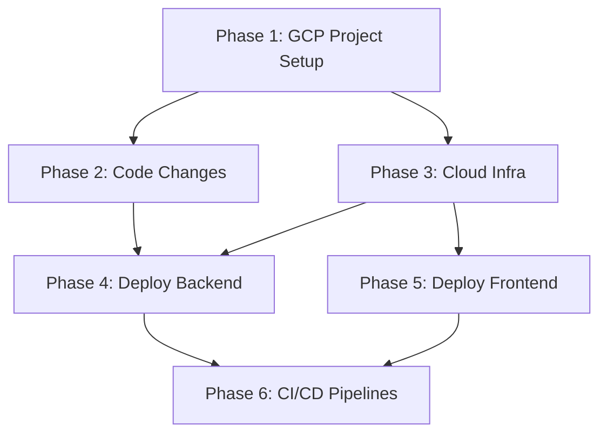

# GrabaKar — GCP Deployment: Evaluation & Plan

## Current Readiness Assessment

### ✅ What's Already GCP-Ready

| Component | Status | Notes |
|---|---|---|
| **Dockerfile** | ✅ Ready | Multi-stage, Cloud Run compatible, `gunicorn` on port 8000 |
| **Env-var config** | ✅ Ready | All settings from `os.getenv()` — DB, Redis, JWT, CORS |
| **`dj-database-url`** | ✅ Installed | In `requirements.txt` (but not used in `base.py` yet) |
| **`psycopg2-binary`** | ✅ Installed | PostgreSQL driver |
| **`production.py`** | ⚠️ Partial | Has SSL/HSTS but missing Cloud SQL socket, logging, `SECURE_PROXY_SSL_HEADER` |
| **`DEPLOYMENT.md`** | ✅ Ready | Already documents GCP architecture and deploy commands |
| **Frontend (Vite build)** | ✅ Ready | `npm run build` → static files in `dist/`, deployable to CDN |

### ❌ What's Missing

| Gap | Effort | Required Before Deploy |
|---|---|---|
| `django-storages[google]` not in `requirements.txt` | 5 min | Yes — for GCS media storage |
| `production.py` incomplete (no Cloud SQL Unix socket, no proxy SSL header, no logging) | 15 min | Yes |
| No Artifact Registry setup | CLI commands | Yes |
| No Cloud Run service or service account | CLI commands | Yes |
| No Cloud SQL instance | CLI/Terraform | Yes |
| No Memorystore (Redis) instance | CLI/Terraform | Yes |
| No Secret Manager secrets | CLI commands | Yes |
| Celery worker strategy for Cloud Run | Design decision | Yes |
| No GitHub Actions deploy workflow (only a template in docs) | 30 min | For CI/CD, not manual deploy |
| No custom domain / SSL certificates | GCP + DNS | For production URLs |
| Frontend hosting not configured (no GCS bucket + CDN) | CLI + build config | Yes |

---

## GCP Architecture ($0/month Minimal Setup)

```
                    ┌─────────────────────────────────────┐
                    │           Cloud CDN (Optional)      │
                    │   app.grabakar.cl (frontend web)    │
                    │   admin.grabakar.cl (admin panel)   │
                    │     Cloud Storage (static buckets)  │
                    └──────────────┬──────────────────────┘
                                   │
    ┌──────────────────────────────┼───────────────────────┐
    │                              │                       │
    ▼                              ▼                       ▼
┌──────────┐              ┌──────────────┐
│Cloud Run │              │ Compute      │
│ Backend  │              │ Engine       │
│ (API)    │              │ (e2-micro)   │
└────┬─────┘              └──────┬───────┘
     │                           │
     └──────────┬────────────────┘
                │
    ┌───────────┴──────────┐
    │  PostgreSQL 16       │
    │  Redis (Mem broker)  │
    │  Celery Worker/Beat  │
    └──────────────────────┘
```

---

## GCP Services & Cost Estimate

### Staging Environment ($0/month Hacker Route)

Using GCP's "Always Free" tier limits:
| Service | Config | Est. Cost/mo |
|---|---|---|
| **Cloud Run (backend API)** | Scales to zero, <2M reqs/mo | $0 |
| **Compute Engine (VM)** | 1 `e2-micro` instance in US region | $0 |
| **Cloud Storage** | web, admin, and media buckets (<5GB) | $0 |
| **Artifact Registry** | Container images (<1GB) | $0 |
| **Secret Manager** | ~10 secrets | $0 |

_Note: The `e2-micro` VM will host PostgreSQL, Redis, and the Celery worker process manually. This eliminates the ~$80/mo cost of managed Cloud SQL + Memorystore + Cloud Run continuous allocation._

### Production Environment (~$100-200/month)
For production, we will transition to managed services:
- Cloud SQL (`db-g1-small` with HA)
- Memorystore (Basic 1GB)
- Cloud Run (min instances = 1 for backend + separate worker)

---

## Architecture Design Decisions

> [!IMPORTANT]
> **Database & Celery:** To achieve $0/mo, we cannot use Cloud SQL or Memorystore. Instead, we'll provision a single free-tier `e2-micro` Debian VM. On this VM we will run Docker containers for Postgres, Redis, and Celery.
> **Backend API:** Will remain on serverless Cloud Run. It will connect to the Postgres/Redis instance running on the e2-micro VM via its internal VPC IP.
> **Frontends:** We now have TWO frontends to deploy to Cloud Storage: `grabakar-frontend` (the operator web app) and `grabakar-admin` (the superadmin panel).

---

## Implementation Phases

### Phase 1 — GCP Project Setup (30 min, manual)

No code changes. All via `gcloud` CLI or GCP Console.

1. Create GCP project: `grabakar-staging`
2. Enable required APIs:
   - Cloud Run, Cloud SQL Admin, Artifact Registry, Secret Manager, Memorystore, Cloud Storage, Cloud Scheduler
3. Create service account: `grabakar-backend@grabakar-staging.iam.gserviceaccount.com`
4. Grant roles: `roles/cloudsql.client`, `roles/secretmanager.secretAccessor`, `roles/storage.objectAdmin`, `roles/run.invoker`

```bash
gcloud projects create grabakar-staging --name="GrabaKar Staging"
gcloud config set project grabakar-staging

# Enable APIs
gcloud services enable \
  run.googleapis.com \
  sqladmin.googleapis.com \
  artifactregistry.googleapis.com \
  secretmanager.googleapis.com \
  redis.googleapis.com \
  storage.googleapis.com \
  cloudscheduler.googleapis.com \
  cloudbuild.googleapis.com
```

---

### Phase 2 — Backend Code Changes (15 min)

#### [MODIFY] [requirements.txt](file:///Users/franciscocollarte/Documents/grabado-patente-app/grabakar-backend/requirements.txt)

Add `django-storages[google]` for GCS media storage:

```diff
+django-storages[google]>=1.14.0
```

#### [MODIFY] [production.py](file:///Users/franciscocollarte/Documents/grabado-patente-app/grabakar-backend/config/settings/production.py)

Expand production settings with Cloud SQL Unix socket, proxy SSL header, logging, and GCS storage:

```python
import os
from .base import *

DEBUG = False

# --- Security ---
SECURE_SSL_REDIRECT = True
SECURE_HSTS_SECONDS = 31536000
SECURE_HSTS_INCLUDE_SUBDOMAINS = True
SECURE_HSTS_PRELOAD = True
SESSION_COOKIE_SECURE = True
CSRF_COOKIE_SECURE = True
SECURE_PROXY_SSL_HEADER = ('HTTP_X_FORWARDED_PROTO', 'https')  # Cloud Run terminates SSL

# --- Cloud SQL Unix Socket ---
# Cloud Run connects to Cloud SQL via Unix socket, not TCP
if os.getenv('CLOUD_SQL_CONNECTION_NAME'):
    DATABASES['default']['HOST'] = f"/cloudsql/{os.getenv('CLOUD_SQL_CONNECTION_NAME')}"

# --- GCS Storage (media files) ---
if os.getenv('GS_BUCKET_NAME'):
    DEFAULT_FILE_STORAGE = 'storages.backends.gcloud.GoogleCloudStorage'
    GS_BUCKET_NAME = os.getenv('GS_BUCKET_NAME')
    GS_DEFAULT_ACL = 'publicRead'

# --- Logging ---
LOGGING = {
    'version': 1,
    'disable_existing_loggers': False,
    'handlers': {
        'console': {'class': 'logging.StreamHandler'},
    },
    'root': {'handlers': ['console'], 'level': 'INFO'},
    'loggers': {
        'django': {'handlers': ['console'], 'level': 'WARNING'},
    },
}
```

---

### Phase 3 — Cloud Infrastructure ($0/mo VM setup)

#### 3A. Artifact Registry (container images)

```bash
gcloud artifacts repositories create grabakar \
  --repository-format=docker \
  --location=us-central1 \
  --description="GrabaKar container images"
```

#### 3B. Compute Engine e2-micro (Postgres + Redis + Celery)

```bash
# Create the VM in a free-tier eligible region (e.g., us-central1)
gcloud compute instances create grabakar-state-vm \
  --project=grabakar-staging \
  --zone=us-central1-a \
  --machine-type=e2-micro \
  --network-interface=network-tier=PREMIUM,subnet=default \
  --tags=http-server,https-server \
  --boot-disk-size=30GB \
  --boot-disk-type=pd-standard

# Once created, we will SSH in and install Docker, then run Postgres/Redis/Celery
```

#### 3D. Secret Manager

```bash
echo -n "$(openssl rand -base64 50)" | gcloud secrets create django-secret-key --data-file=-
```

#### 3E. Cloud Storage (frontends + media)

```bash
# Operator Web App
gcloud storage buckets create gs://grabakar-frontend-staging \
  --location=us-central1 \
  --uniform-bucket-level-access

# Admin Panel
gcloud storage buckets create gs://grabakar-admin-staging \
  --location=us-central1 \
  --uniform-bucket-level-access

# Media uploads
gcloud storage buckets create gs://grabakar-media-staging \
  --location=us-central1
```

---

### Phase 4 — Deploy Backend to Cloud Run

```bash
# Build and push image
gcloud builds submit \
  --tag us-central1-docker.pkg.dev/grabakar-staging/grabakar/backend:latest \
  ./repos/grabakar-backend

# Deploy API
gcloud run deploy grabakar-backend \
  --image us-central1-docker.pkg.dev/grabakar-staging/grabakar/backend:latest \
  --platform managed \
  --region us-central1 \
  --allow-unauthenticated \
  --set-env-vars "DJANGO_SETTINGS_MODULE=config.settings.production" \
  --set-env-vars "DB_HOST=<VM_INTERNAL_IP>,DB_NAME=grabakar,DB_USER=grabakar,DB_PORT=5432" \
  --set-env-vars "CELERY_BROKER_URL=redis://<VM_INTERNAL_IP>:6379/0" \
  --set-env-vars "CORS_ALLOWED_ORIGINS=https://staging.grabakar.cl,https://admin.grabakar.cl" \
  --set-secrets "DJANGO_SECRET_KEY=django-secret-key:latest" \
  --min-instances 0 \
  --max-instances 2 \
  --memory 512Mi \
  --cpu 1
```

*(Note: Migrations will be run from the VM or locally pointing to the VM's postgres instance)*

---

### Phase 5 — Deploy Frontends to Cloud Storage

#### 5A. Operator Web App (grabakar-frontend)
```bash
cd repos/grabakar-frontend
npm run build
gcloud storage cp -r dist/* gs://grabakar-frontend-staging/
gcloud storage buckets add-iam-policy-binding gs://grabakar-frontend-staging --member=allUsers --role=roles/storage.objectViewer
gcloud storage buckets update gs://grabakar-frontend-staging --web-main-page-suffix=index.html --web-not-found-page=index.html
```

#### 5B. Admin Panel (grabakar-admin)
```bash
cd repos/grabakar-admin
npm run build
gcloud storage cp -r dist/* gs://grabakar-admin-staging/
gcloud storage buckets add-iam-policy-binding gs://grabakar-admin-staging --member=allUsers --role=roles/storage.objectViewer
gcloud storage buckets update gs://grabakar-admin-staging --web-main-page-suffix=index.html --web-not-found-page=index.html
```

---

### Phase 6 — CI/CD (GitHub Actions)

Create deploy workflow in `grabakar-backend/.github/workflows/deploy.yml` and `grabakar-frontend/.github/workflows/deploy.yml`. These follow the template already in [DEPLOYMENT.md](file:///Users/franciscocollarte/Documents/grabado-patente-app/grabakar-docs/tecnico/DEPLOYMENT.md#L228-L259).

**GitHub Secrets Required:**
- `GCP_SA_KEY` — Service account key JSON
- `GCP_PROJECT` — Project ID
- `GCP_REGION` — `southamerica-east1`

---

## Implementation Order & Dependencies



| Phase | Estimated Time | Prerequisites |
|---|---|---|
| 1. GCP Project | 30 min | GCP account with billing |
| 2. Code Changes | 15 min | None |
| 3. Cloud Infra | 45 min | Phase 1 |
| 4. Deploy Backend | 30 min | Phases 2+3 |
| 5. Deploy Frontend | 15 min | Phase 3 |
| 6. CI/CD | 30 min | Phases 4+5 |
| **Total** | **~3 hours** | |

---

## User Review Required

> [!IMPORTANT]
> **GCP billing account**: You need a GCP account with billing enabled, even for free-tier resources. We are targeting the **$0/month** staging environment using the `e2-micro` VM.
> **Domain names**: The plan will use your domain `panchopin.com` (e.g., `app.panchopin.com` and `admin.panchopin.com`). This requires configuring DNS records in your domain registrar to point to GCP buckets and Cloud Run.

## Verification Plan

### After Phase 4 (Backend Deploy)
```bash
# Health check
curl https://<cloud-run-url>/api/v1/health/

# Login test
curl -X POST https://<cloud-run-url>/api/v1/auth/login/ \
  -H "Content-Type: application/json" \
  -d '{"username":"admin","password":"<password>"}'
```

### After Phase 5 (Frontend Deploy)
- Open `https://storage.googleapis.com/grabakar-frontend-staging/index.html` in browser
- Verify the app loads and shows login page

### After Phase 6 (CI/CD)
- Create a test PR in `grabakar-backend`
- Verify GitHub Actions runs CI + auto-deploys to staging on merge
